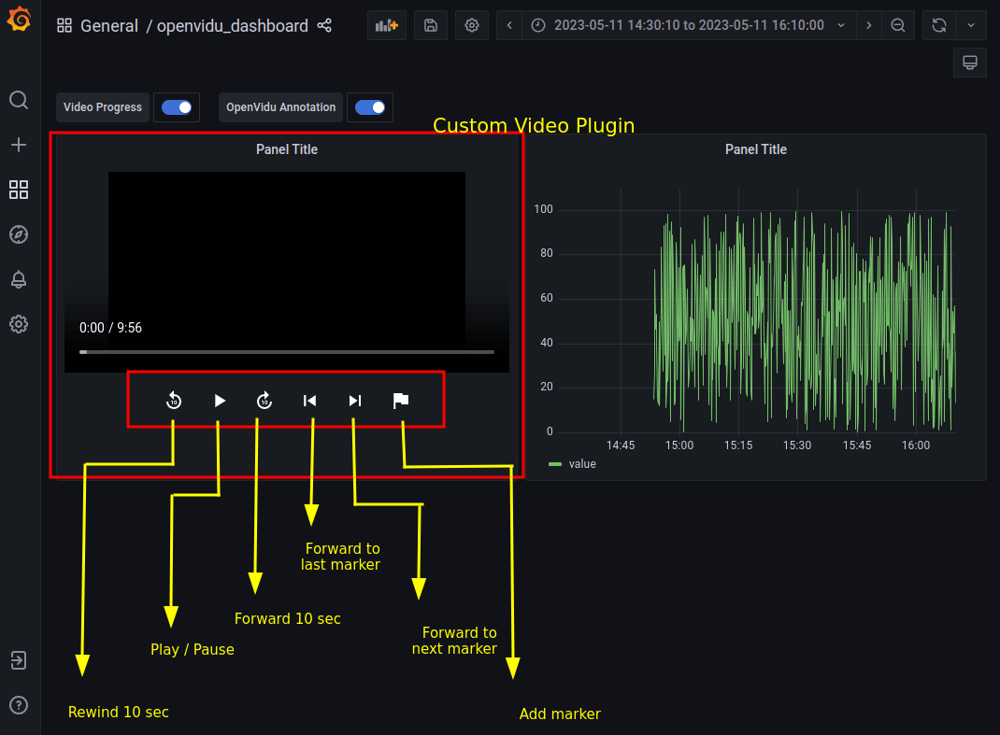
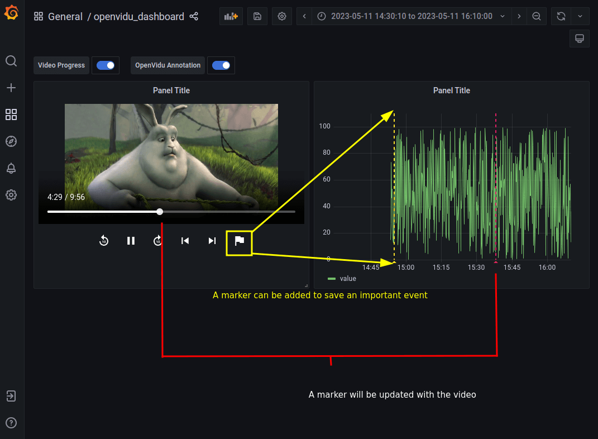

# openvidu-grafana-plugin


> WARN: This custom plugin has been only tested with an **unique video player**. It is not tested with multiple video players and it may not work properly.

> WARN: This custom plugin **only works with Time Series Panel**


## Description

This project is a sample of how to integrate OpenVidu with Grafana.

It uses the [openvidu-video-panel](openvidu-video-panel), which is a grafana panel plugin that allows to show an interactive video integrated with other grafana panels.

This project also contains a grafana dashboard connected to a MySQL database, which is used to store the data of the video panel and datasource for data panels.

The data is generated by a [sql script](mysql/db_script.py) that is executed when the MySQL container is started.
This script will generate two tables:
*	**video_data**: stores the metadata of the videos (`graph_timestamp` in miliseconds, `video_time_seconds` which represents the second of the video and `video_url` which is the url of the video)


```sql
SELECT
  graph_timestamp AS "time",
  video_time_seconds,
  video_url
FROM video_data
ORDER BY time
```


* **metric_data**: stores the random data for printing time series panel on grafana dashboard (`graph_timestamp` same values to video_metadata table and `value` which is a random number)

```sql
SELECT
  graph_timestamp AS "time",
  value
FROM metric_data
ORDER BY time
```

Both the Grafana and MySQL containers are started using docker-compose. All the configuration is in the [docker-compose.yml](docker/docker-compose.yml) file.

Moreover, the `db_initializer` service which is used to execute the [sql script](mysql/db_script.py) is started using docker-compose. Here is where the video urls are set (splitted by comma).


## Features

* **Video panel**: allows to play and pause a video.
* **Video connected to the TimeSeries panel**: When hovering over the time series panel, the video will be updated to the time of the hovered point.
* **Rewind button**: allows to rewind the video to 10 seconds ago.
* **Forward button**: allows to forward the video to 10 seconds later.
* **Video panel with annotations**: allows to add a marker to the time series panel in the current time of the video.

* **Skip to next annotation**: allows to skip to the next annotation in the time series panel.
* **Skip to previous annotation**: allows to skip to the previous annotation in the time series panel.
* **Annotation progress**: when video is playing the annotation progress will be updated and it is represented by a red line in the time series panel.


## Requirements

The following technologies must be installed in your computer

* Docker Compose
* NodeJS and npm
* yarn: `npm install --global yarn`


## Run this sample

1.  Runnin the openvidu-video-panel project:

Under `openvidu-video-panel` path:

```bash
yarn build
```

2. Running MySQL and Grafana

```bash
yarn server
```

Once every service is ready, you can access to the grafana dashboad on [localhost:3000](http://localhost:3000/d/2xkhR8Y4k/openvidu_dashboard?orgId=1)


## Screenshots






## Video sample

<a href="https://github.com/OpenVidu/openvidu-grafana-plugin/raw/master/docs/openvidu-grafana.mp4">Download</a> 

<video controls>
  <source src="docs/openvidu-grafana.mp4" type="video/mp4">
  Your browser does not support the video tag.
</video>


## Plugin integration

For integrating the openvidu video panel to your own grafana dashboard, you can follow the next steps:

As we are using Docker, we have add a [volume to the docker-compose file](https://github.com/OpenVidu/openvidu-grafana-plugin/blob/b477320162bbf47f99603190d620f57b10a1ad03/docker/docker-compose.yml#L38)

If you don't use docker, you can follow the next steps:

Copy the [openvidu-video-panel](openvidu-video-panel) folder to your grafana plugins folder. By default, it is located in `/var/lib/grafana/plugins` in Linux and `C:\Program Files\GrafanaLabs\grafana\data\plugins` in Windows.


